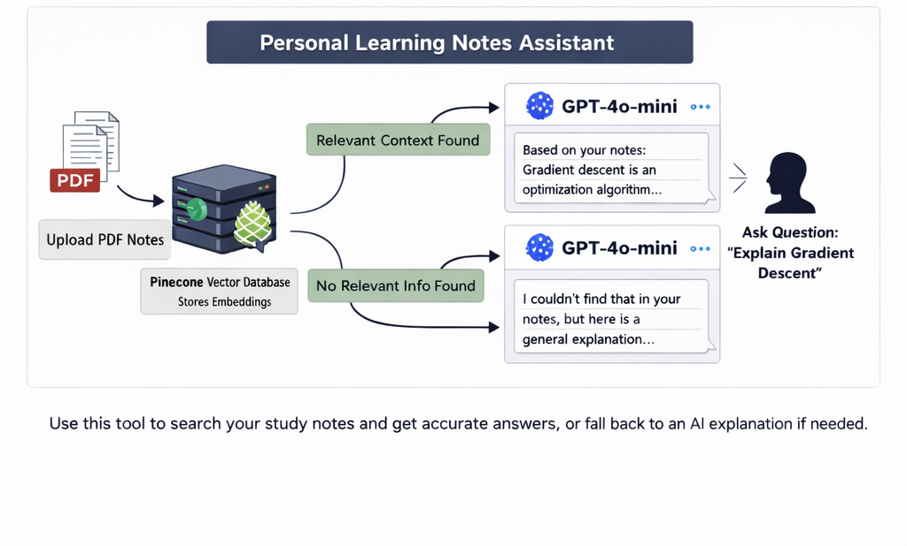

# 📚 Personal Learning Notes Assistant (RAG Project)

A simple Retrieval-Augmented Generation (RAG) system that allows me to upload my study PDFs and ask questions based on my own notes.

Instead of manually searching through long documents, I can ask questions in natural language and get contextual answers grounded in my uploaded material.

---

## 🚀 Why I Built This

While preparing for Machine Learning interviews, I had multiple PDFs and handwritten notes. Searching manually was time-consuming.

So I built a semantic search assistant that:

* Understands my question
* Retrieves relevant sections from my notes
* Generates a contextual answer
* Falls back to a general explanation if the topic is not found

This helped me understand how RAG systems work end-to-end.

---

## 🧠 How It Works (Architecture)

1. Upload PDF
2. Split document into chunks
3. Generate embeddings using OpenAI
4. Store vectors in Pinecone
5. Retrieve top-k relevant chunks
6. Send retrieved context to GPT-4o-mini
7. Generate grounded answer

If no relevant context is found:

> The system clearly states that the topic wasn’t found in the notes and provides a general AI explanation.

---

## 🛠 Tech Stack

* **LangChain** – Orchestration
* **OpenAI (gpt-4o-mini)** – LLM for answer generation
* **OpenAI Embeddings** – Text vectorization
* **Pinecone** – Vector database
* **PyPDFLoader** – PDF parsing
* **Google Colab** – Development environment

---

## 📂 Project Flow

```
PDF → Chunking → Embeddings → Pinecone → Retrieval → GPT-4o-mini → Answer
```

---

## 🎯 Features

* Upload and index personal study notes (PDF)
* Semantic search over documents
* Context-aware answers
* AI fallback if content not found
* Minimal and clean RAG implementation

---

## 💬 Example Query

**Question:**

> Explain gradient descent

**If found in notes:**
Answer generated strictly from uploaded content.

**If not found:**
System responds:

> “I could not find this in your uploaded notes, but here is a general explanation.”

---

## 📸 Architecture Diagram


And display it in README like this:

```markdown

```

---

## 🧪 How to Run (Colab)

1. Install dependencies
2. Add OpenAI & Pinecone API keys
3. Upload PDF
4. Ask questions

---

## 🧩 What I Learned

* How chunk size affects retrieval quality
* How embeddings enable semantic search
* How to ground LLM responses using retrieved context
* Basic hallucination control using prompt design
* End-to-end RAG pipeline architecture

---

## 🔮 Future Improvements

* Add similarity threshold filtering
* Add source citation (page numbers)
* Build Streamlit UI
* Add multi-document support

---

## 👨‍💻 Author

Built as part of my AI/ML interview preparation to better understand practical RAG system implementation.

---

If you want, I can now also write:

* ⭐ A short 2-line GitHub description
* ⭐ Resume-ready project description
* ⭐ LinkedIn project post
* ⭐ Interview explanation script (1 minute version)

Just tell me.
